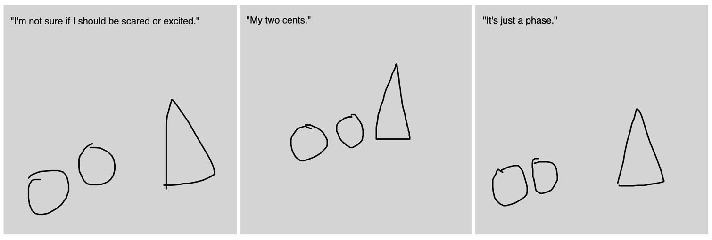

# Assignment Set #5

### Due Wednesday, October 2

There are OpenProcessing slots for the two deliverables below. 

--- 

## 5.1 (Exercise): Canvas Describer

*(20% - 15 minutes)* In this brief exercise, you're asked to modify a simple example sketch in a hopefully interesting way. This is intended to be a quick exercise to make sure you're able to work with the Google Gemini API.  

[**This demonstration program**](https://openprocessing.org/sketch/2369075) asks the user to make a drawing on the p5 canvas; it transmits the canvas to the [Google Gemini AI](https://ai.google.dev/gemini-api/docs) for analysis; and then it asks Gemini to generate a text response to that image — conditioned by a hard-coded text prompt in the p5.js code. *Now*, do the following: 

* **Create** a Google AI Studio developer test API key, using these instructions: 
  1. Go to the [Google AI Studio website](https://ai.google.dev/aistudio)
  2. Sign in with your Google account
  3. Navigate to the API Keys section (the blue "Get API Key" button on the top left)
  4. Click on the "Create API Key" button
  5. Follow the prompts to create a new project or select an existing one.
  6. Enable the Gemini API for your project.
  7. Copy the generated API key and paste it into the "API KEY" input field in the web application.
  8. Note: Make sure to keep your API key secure and avoid sharing it publicly.
* **Create** a simple riff of [**this demonstration program**](https://openprocessing.org/sketch/2369075) by forking this sketch and changing the prompt. You're welcome to modify the graphics and/or interaction code if you wish, but that's not required for this small exercise. **Upload** your project to [this collection](https://openprocessing.org/class/93074/#/c/94365) in our OpenProcessing classroom ("5.1. Canvas Describer"). 
* In the Discord channel `#05-canvas-describer`, **paste** your revised prompt, and **embed** a few screenshots of your program in use. **Write** a sentence or two about other things you tried, critical reflection, etc. 

---

## 5.2 (Project) LLM-Boosted Interaction

*(80% - 3-4 hours)* In this project, you are asked to **make** an app in p5.js that uses the Google Gemini API to do something interesting.

It helps to understand what's possible! Please **browse** the [Google Gemini API documentation](https://ai.google.dev/gemini-api/docs/). Observe how the Gemini AI is able to do things like: 

* [Describe, summarize, and answer questions about text](https://ai.google.dev/gemini-api/docs/document-processing?lang=python#upload-document)
* [Describe, summarize, and answer questions about an image](https://ai.google.dev/gemini-api/docs/vision?lang=python#upload-image)
* [Provide the bounding box for an object in an image](https://ai.google.dev/gemini-api/docs/vision?lang=python#bbox)
* [Describe, summarize, and answer questions about audio](https://ai.google.dev/gemini-api/docs/audio?lang=python#upload-audio)
* [Provide a transcription of audio](https://ai.google.dev/gemini-api/docs/audio?lang=python#transcript)

**Check out** the examples below to see how some other people have used Google's Gemini AI to make interesting interactions in p5.js. *This is not an exhaustive list of techniques or possibilities!*

* [*Gemini API starter examples*](https://x.com/pitaru/status/1819797112399511625) by Amit Pitaru: Gemini AI describes p5.js canvas. [Minimal Demo](https://editor.p5js.org/pitaru/sketches/Ixu00bucD); [Version with instructions](https://editor.p5js.org/pitaru/sketches/NSAqfrdJY).
* [*Ask Gemini with Audio*](https://editor.p5js.org/pitaru/sketches/NSAqfrdJY)
* [*One Line, One Word*](https://editor.p5js.org/alexanderchen/sketches/UIPy0LXjm) by Alexander Chen. The AI describes the quality of a line. [Tweet](https://x.com/alexanderchen/status/1819939988676440241)
* [*Stick Figure Theater*](https://editor.p5js.org/alexanderchen/sketches/ndd3oqln2) by Alexander Chen.  Draw a character, and Gemini will try to return a line of dialogue. [Tweet](https://x.com/alexanderchen/status/1821011074658828481)
* [*Word sorter*](https://editor.p5js.org/trudypainter/sketches/cSN7DNnWG) by Trudy Painter. Organizes words along user-defined spectra. [Tweet](https://x.com/trudypainter/status/1820555477455167900)
* [*Grow a Seed*](https://editor.p5js.org/pitaru/sketches/z7Cq3HEtjo) AI-collaborative drawing tool by Amit Pitaru. Note the insanely short code. [Tweet](https://x.com/pitaru/status/1821310018198642867)
* [*Crappy gaze Estimation*](https://editor.p5js.org/golan/sketches/sktetHnz8)
* [*Life's biggest questions*](https://editor.p5js.org/ttarigh/sketches/oibptLN-L) -[Tweet](https://x.com/tinaz0ne/status/1824153041597239433)
* [*Let's Dance*](https://editor.p5js.org/pitaru/sketches/-ujxN6JUr) by Amit Pitaru - [Tweet](https://x.com/pitaru/status/1822453415013650768)

Please note that you might need to modify the code of `geminiAPI.js` in order to implement a concept with unusual functionality. *Also, please note that while it is possible to [enable reduced content safety settings in Google Gemini](https://ai.google.dev/gemini-api/docs/safety-settings#safety-filtering-per-request), your projects should still adhere to our Syllabus [Code of Conduct guidelines](https://github.com/golanlevin/60-212/blob/main/2024/syllabus/60-212_syllabus_fall2024.md#code-of-conduct).* 

*Now*: 

* **Create** an app in p5.js that uses the Google Gemini API to do something interesting.
* In the Discord channel `#05-gemini-app`, **describe** your project, and **embed** a few screenshots (or an animated GIF, or an unlisted YouTube video) of your program in use. **Write** a sentence or two of critical reflection about your project and/or process.

