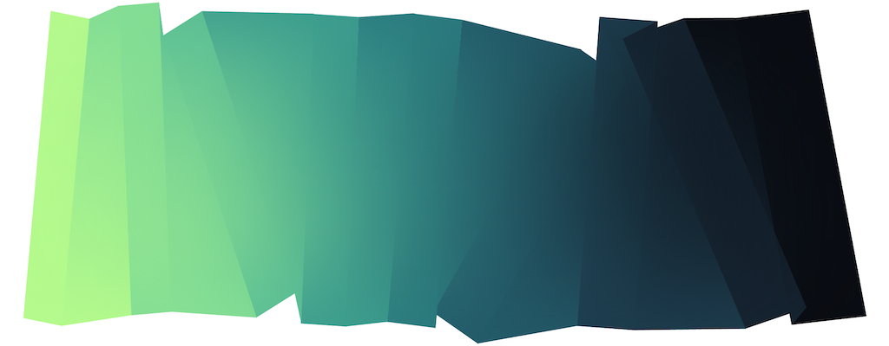
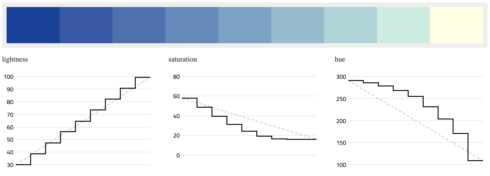
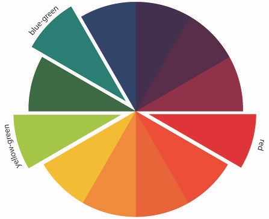
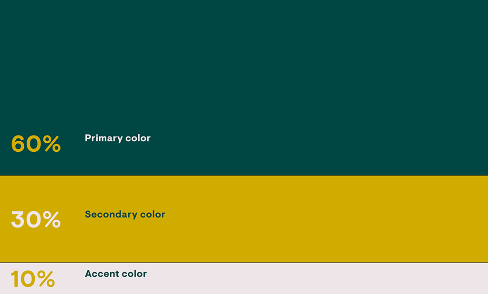

# Assignment Set #6

 [*Albers*, an artwork by David Aerne](https://albers.elastiq.ch/)

## Due Monday 10/7 and Wednesday 10/9

This assignment is mostly technical, and has 6 parts:

Due **Monday** 10/7:

* 6.1. Readings: Computational Color
* 6.2. Interactives: Color Explorers

Due **Wednesday** 10/9:

* 6.3. Four-Color Gradient
* 6.4. Split Complementaries
* 6.5. 60-30-10 Composition
* 6.6. Color Relativity

The following p5.js **template demos/code** may be helpful for this Assignment: 

* [Dead-simple Chroma + p5 example at OpenProcessing](https://openprocessing.org/sketch/2384439)
* [Chroma.js + p5.js](https://editor.p5js.org/golan/sketches/2pkxnwYxF)
* [Texel/Color + p5.js](https://editor.p5js.org/golan/sketches/Ya1xm67i6)
* [Mixbox + p5.js](https://editor.p5js.org/golan/sketches/FPtOVXlpV)

*Note: The "60-30-10 Composition" exercise has the most room for creativity, but making an original composition will be considered extra credit.* 

---

### 6.1. Readings: Computational Color

(*10%, 30 minutes*) **Read** the following two articles by Monday October 7: 

* [*Computational Color*](http://printingcode.runemadsen.com/lecture-color/) by Rune Madsen (15 minute read)
* [*Okay, Color Spaces*](https://ericportis.com/posts/2024/okay-color-spaces/), Eric Portis, 2024. Includes interactives. (15 minute read)

*Now*: In the Discord channel, `#06-color-readings`, **write** a sentence of reflection about something that you found interesting or helpful from these readings. 

---

### 6.2. Interactives: Color Explorers

(*15%, 30 minutes*) By Monday October 7: **Interact** with each of the following interactive color explorers for a few minutes apiece: 

* [**Chroma.js Color Palette Helper**](https://gka.github.io/palettes/#/9|s|00429d,96ffea,ffffe0|ffffe0,ff005e,93003a|1|1)
* David Aerne's [**Poline**](https://meodai.github.io/poline/)
* David Aerne's [**Rampensau**](https://meodai.github.io/rampensau/).
* Cynthia Brewer's [**Color Advice for Cartographers**](https://colorbrewer2.org/#type=sequential&scheme=BuPu&n=3)
* [**OK Color Picker**](https://bottosson.github.io/misc/colorpicker/) by Björn Ottosson
* [**OKLCH Color Picker & Converter**](https://oklch.com/#77.33,0.141,123.88,100) by Evil Martians

*Now*: In the Discord channel, `#06-color-explorers`, **write** a sentence of reflection about something that you found interesting or helpful from interacting with these tools. 

---

### 6.3. Four-Color Gradient

(*10%, 30 minutes*) This is due at the ***end*** of class on Wednesday October 9: 

* **Read** or **skim** this article: [*Mastering Multi-hued Color Scales with Chroma.js*](https://www.vis4.net/blog/mastering-multi-hued-color-scales/)
* Carefully **examine** this [Chroma.js+p5 example](https://editor.p5js.org/golan/sketches/2pkxnwYxF), — especially the `scale` feature of Chroma.js.
* Feel free to **study** and/or **fork** this [dead-simple Chroma + p5 example at OpenProcessing](https://openprocessing.org/sketch/2384439).
* **Create** a sketch that presents a smooth gradient through four colors. 
* In a separate part of your canvas, **display** chips of the four colors in isolation. 
* **Respond** to this question, in a comment in your p5 code: *which color interpolation technique did you use and why?*
* **Save** your work to the correct slot in our OpenProcessing classroom.

---

### 6.4. Split Complementaries

(*15%, 30 minutes*) This is due at the ***end*** of class on Wednesday October 9: 

A color’s “split complements” are a pair of colors that are opposite, but just adjacent (±15–30°) on the color wheel. Here, you are asked to create an interactive sketch that displays swatches of the split complements for a randomly generated color. *For this assignment, you are asked to use an advanced color library, such as [Chroma.js](https://editor.p5js.org/golan/sketches/2pkxnwYxF), [Texel/Color](https://editor.p5js.org/golan/sketches/Ya1xm67i6), [Mixbox](https://editor.p5js.org/golan/sketches/FPtOVXlpV): [github](https://github.com/scrtwpns/mixbox), [Color.js](https://colorjs.io/), or [Culori.js](https://culorijs.org/).*

* For this project, feel free to **study** and/or **fork** this [dead-simple Chroma + p5 example at OpenProcessing](https://openprocessing.org/sketch/2384439).
* [**Modify** the code from this empty sketch](https://editor.p5js.org/golan/sketches/VtdpsUYLU) so that the chips are colored with split complementaries. Your program should generate a new set of colors each time the user clicks the mouse button. 
* **Save** your work to the correct slot in our OpenProcessing classroom.

---

### 6.5. 60-30-10 Composition

(*25%, 60 minutes*) This is due at the ***end*** of class on Wednesday October 9: 

* **Watch** [this 3-minute video about the "60-30-10 rule"](https://www.youtube.com/watch?v=rAfjUOkbyr0).
* [This p5.js sketch](https://editor.p5js.org/golan/sketches/U5EgeSwwR) presents a set of three colors in approximately 60-30-10 proportions. **Modify** [this sketch](https://editor.p5js.org/golan/sketches/U5EgeSwwR) to use a satisfying trio of colors, replacing lines 14-16 with a generative strategy. Your program should generate a new set of colors each time the user clicks the mouse button.
* *For this assignment, you are asked to use an advanced color library, such as [Chroma.js](https://editor.p5js.org/golan/sketches/2pkxnwYxF), [Texel/Color](https://editor.p5js.org/golan/sketches/Ya1xm67i6), [Mixbox](https://editor.p5js.org/golan/sketches/FPtOVXlpV): [Mixbox](https://github.com/scrtwpns/mixbox), [Color.js](https://colorjs.io/), or [Culori.js](https://culorijs.org/).*
* **FOR EXTRA CREDIT** — *If you would like to have a more creative version of this assignment: feel free to change the composition however you wish — so long as the three colors are still distributed in approximately 60-30-10 proportions. I will award extra credit proportional to how inventive you are about generating such compositions.*
* **Save** your work to the correct slot in our OpenProcessing classroom.

---

### 6.6. Color Relativity

(*25%, 45 minutes*) This is due at the ***end*** of class on Wednesday October 9: 

* **Create** a program to generate novel color sets that always fulfill the *four-look-like-three* condition. Your program should generate a new set of colors each time the user clicks the mouse button. Demonstrate the relativity of color by duplicating the spots’ colors in a location where they can be more easily compared. 
* *For this assignment, you are asked to use an advanced color library, such as [Chroma.js](https://editor.p5js.org/golan/sketches/2pkxnwYxF), [Texel/Color](https://editor.p5js.org/golan/sketches/Ya1xm67i6), [Mixbox](https://editor.p5js.org/golan/sketches/FPtOVXlpV), [Color.js](https://colorjs.io/), or [Culori.js](https://culorijs.org/).*
* **Save** your work to the correct slot in our OpenProcessing classroom.

