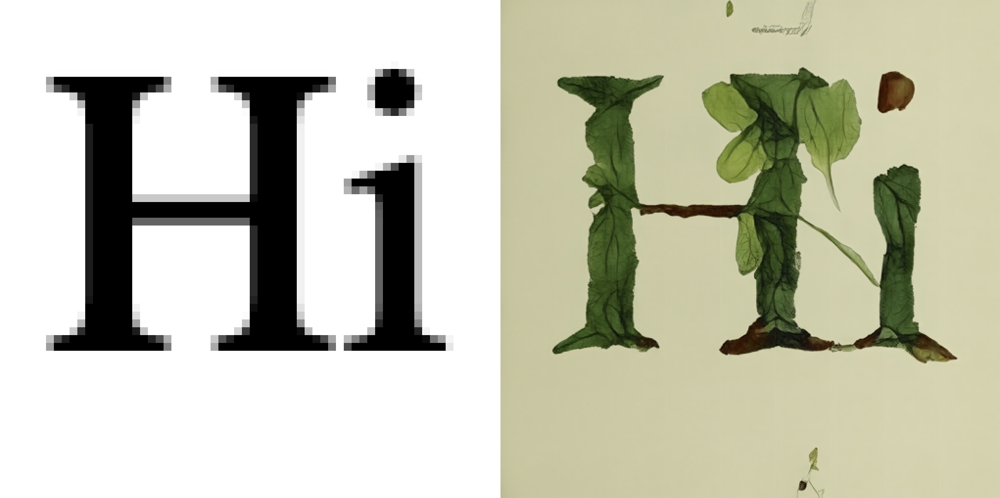

# Assignment Set #9

## Creative Coding with AI

* **9.1. Dino Diffusion + p5 Exercise** (10%, 45 minutes)
* **9.2. Situated Eye • Poetic Surveillant** (50%, 6 hours)
* **9.3. Readings/Viewings** TBA
* **9.4. ComfyUI I: AI Channels.** TBA
* **9.5. ComfyUI II: p5 Conditioning.** TBA

---

## 9.1 Dino Diffusion + p5 Exercise

*(10%, 45 minutes)* [Diffusion models](https://en.wikipedia.org/wiki/Diffusion_model) are the core AI algorithms used in popular image generation tools like Midjourney and DALL-E. In this warm-up exercise, you will experiment with using custom generative p5.js graphics to "condition" (guide) a simple diffusion AI. We will base our work on "Dino Diffusion", an ultra-minimal diffusion model created by [Ollin Boer Bohan](https://madebyoll.in/) that generates 512×512 botanical images in the browser. 

* **Read** "[Dino Diffusion: Bare-bones Diffusion Models](https://madebyoll.in/posts/dino_diffusion/)" (2023) by Ollin Boer Bohan. (You can play with Bohan's [demo here](https://madebyoll.in/posts/dino_diffusion/demo/).) This is an estimated 12-minute reading.
* **Write** a sentence sharing something you learned from this article, in the Discord channel `09-dino-reading`.
* **Fork** [this OpenProcessing sketch](https://openprocessing.org/sketch/2321795), which is a p5.js port of Bohan's Dino-Diffusion project. (Make sure your forked sketch includes the 8MB ONNX model file, "network.onnx"; if you're lacking this file for some reason, you can also find it [here](https://github.com/golanlevin/dino-diffusion-p5/tree/main).)
* **Experiment** with this sketch as follows:
  * Press RETURN to start or re-start the AI process.
  * Press SPACE to clear the canvas and start over.
  * Press a letter key (and then RETURN) to guide the AI with that letter.
  * **Draw** on the canvas with the cursor to provide input to the AI.
* *Now*, **modify** the code of this sketch, specifically creating your own generative image for guiding the AI. You are expected to do this by modifying the  `generateInputImage()` function. (There are no other parts of the code that should be modified.) Keep in mind that your graphics must be rendered into the `inputGraphics` buffer, an offscreen image whose dimensions are 64×64 pixels. Your program should generate a novel input image every time the user presses a key. (What works well? What doesn't? Why do you suppose?)
* Upload your sketch to the [corresponding slot]() in our OpenProcessing classroom.

---

## 9.2. Situated Eye • Poetic Surveillant

9.2. Create a machine that asks a question of the world. Your machine should either measure/detect something interesting, measure/detect something in an interesting way, or create an interesting provocation by bringing an uncommon measurement/detection to our attention. The emphasis here is on the selection and collection of intriguing data, rather than on the production of an attractive interpretation or visualization. What overlooked dynamics or invisible rhythms can you discover?

In this project, you are asked to create a “situated eye” – a “contextualized classifier” – a “purposeful detector” – a “poetic surveillant“. You are asked to create a camera-based system:

* which is located in a specific place;
* which is trained to detect a specific thing (or things);
* and which responds to what it sees, in an interesting way.

Example Projects: 

* [Irene (2m)](https://www.youtube.com/watch?v=T2qQGqZxkD0)
* [Irene (30m)](https://vimeo.com/514957215)
* [Lucas & Gautam, Teachable Sorter](https://www.youtube.com/watch?v=ydzJPeeMiMI)
* [Teaching a bell to ring when your pancakes are ready](https://medium.com/google-design/teaching-a-bell-to-ring-when-your-pancakes-are-ready-d65db43fffe5) (2020)

Template Code: 

* [ml5 + teachable machine](https://openprocessing.org/sketch/2430277)
* [handPose Rock-Paper-Scissors, ml5v1](https://openprocessing.org/sketch/2428446)
* [bodyPose Training & Recognition, ml5v1](https://openprocessing.org/sketch/2428616)
* [1D Regression using ml5v.0.12.2](https://editor.p5js.org/golan/sketches/dvQldQn7w)
* [2D Regression using ml5v.0.12.2](https://editor.p5js.org/golan/sketches/B96GvGSA-)
* [ml5 tm ref](https://docs.ml5js.org/#/reference/image-classifier-tm)

---

## **9.3. Readings/Viewings** *TBA*
## **9.4. ComfyUI I: Image Analysis.** *TBA*
## **9.5. ComfyUI II: Image Synthesis.** *TBA*

