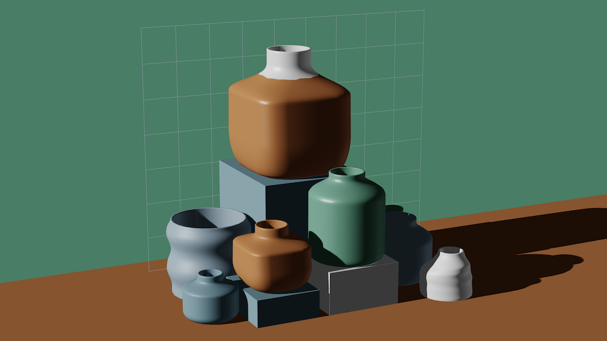
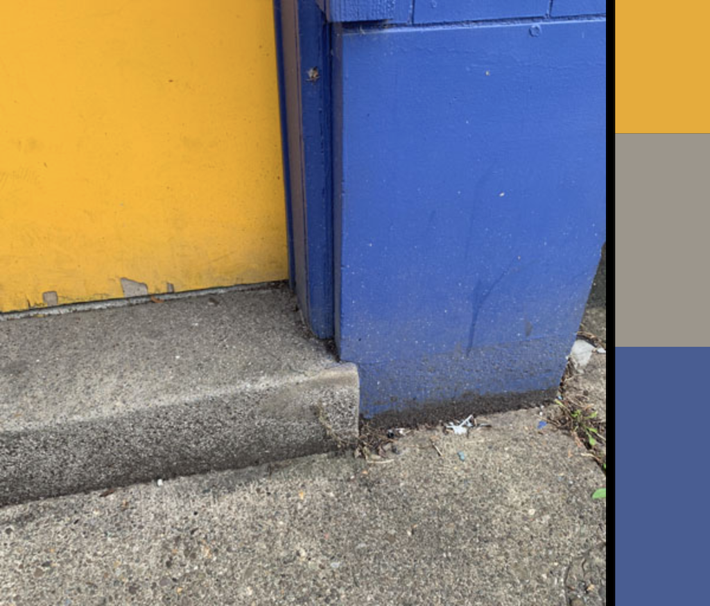

# 10/07/2024

*Today is Monday, October 7. Welcome!*

* Attendance
* Plan for the week
* Looking outwards over Fall Break
* Technical presentation
* Work Session for Assignment #6

---

## A Few Artworks 

Here are a few artworks that make use of better tools for color:

* Anatoly Zenkov's [**Parametric Pottery**](https://anatolyzenkov.com/parametric-pottery/preview/22) (click!) & [code](https://anatolyzenkov.com/preview/parametric-pottery/js/colors.js) (uses OKlab!)
* Kjetil Golid's [**Archetype**](https://www.artblocks.io/curated/collections/archetype-by-kjetil-golid?tab=Artworks)
* David Aerne's [**Albers**](https://albers.elastiq.ch/)

---
## Technical Presentation

[Last week's introduction to color spaces](../../lectures/color/readme.md)

*It turns out that the tools you've been using to control color represent a massive trade-off. Controlling color with RGB are HSB is computationally efficient and pedagogically simple, but you've been eating dog food. If we're willing to do a little more work in meal preparation, we can do a lot better.*

How to **interpolate** colors: 

* [Simple interpolation demo](https://editor.p5js.org/golan/sketches/r7BTC6kdl)
* **Observe** how the HSL interpolation can flip!

**Converting** RGB to HSL: 

* [Equations in code](https://gist.github.com/mjackson/5311256#file-color-conversion-algorithms-js) — purely FYI, so you've seen it
* [Demonstration using p5.js convenience functions](https://editor.p5js.org/golan/sketches/2JtecuvS5)

**Problems** in color interpolation:

* [Interpolating two colors in RGB vs HSL](https://editor.p5js.org/golan/sketches/y48rXgXZv)
* **Observe** how interpolation through different spaces produces different results
* **Observe** how interpolation (through cheap spaces) can be counterintuitive

It's **not just** about interpolaton: 

* [Randomized colors in RGB and HSL](https://editor.p5js.org/golan/sketches/h3ltTBZUd)
* **Observe** how generating colors with randomness suffers from the same issues as interpolation

Introducing some **better tools**: 

* [Yellow to Blue in p5.js](https://editor.p5js.org/golan/sketches/H82KcF8eB) - the baseline
* [Yellow to Blue with Chroma.js in p5](https://editor.p5js.org/golan/sketches/GZB2ZbJoW) - leveling up (dead simple demo)
* [Chroma.js + p5 at OpenProcessing](https://openprocessing.org/sketch/2384439) (dead simple demo)

**More** color tools: 

* [Texel/Color by Matt Deslauriers, p5 demo](https://editor.p5js.org/golan/sketches/Ya1xm67i6)
* [Texel/Color + p5 at OpenProcessing](https://openprocessing.org/sketch/2384613) (dead simple demo)
* [Mixbox by Šárka Sochorová, p5 demo](https://editor.p5js.org/golan/sketches/FPtOVXlpV)

**Bonus**: k-Means Color Clustering

* [Simple k-Means demo in p5](https://editor.p5js.org/golan/sketches/NsB-qHte8)
* [Color k-Means demo in p5](https://editor.p5js.org/golan/sketches/bkP_BPWT7)

---

## Worktime on Assignment #6

* 6.3. Four-Color Gradient
  * **Study** this [example Chroma+p5 project](https://editor.p5js.org/golan/sketches/2pkxnwYxF), especially following line 87. 
* 6.4. Split Complementaries
  * **Modify** [this empty template code](https://editor.p5js.org/golan/sketches/VtdpsUYLU) for your homework.
* 6.5. "60-30-10" Composition
  * **Modify** [this empty template code](https://editor.p5js.org/golan/sketches/U5EgeSwwR) for your homework
* 6.6. Color Relativity

