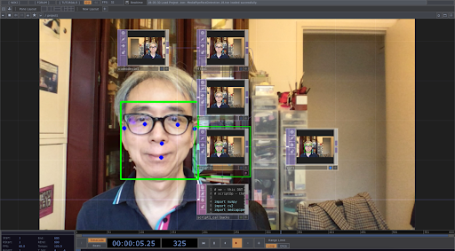

# 11/20/2024

*Today is Monday, Novenber 20th. Welcome!*

---
## Agenda
* Due : Assignments **10.1, 10.2**
* Previous Semesters and Viewings. 
* What I mean by Interaction
* Touchdesigner First Steps / Refresher 

## Previous Semester viewings

## Interactive Extractions  
### Commercial stuff
* [Deeplocal Installations](https://www.deeplocal.com/google-store-chelsea-2023-refresh)

### Artists
*   [the_poet_engineer](https://www.instagram.com/the.poet.engineer/) 
* [Crystal Jow](https://www.crystaljow.com/portfolio)

### Tools
* [GPU accellerated Mediapipe](https://www.youtube.com/watch?v=Cx4Ellaj6kk&t=5s) by Torin Blankensmith
    * can track Hands, Face, Body
    * Object tracking
    * Object Classification
    * Image Segmentation

* OSC

* MIDI

* Optical Flow and Motion Detection

*  Whisper withx ChatGpt

